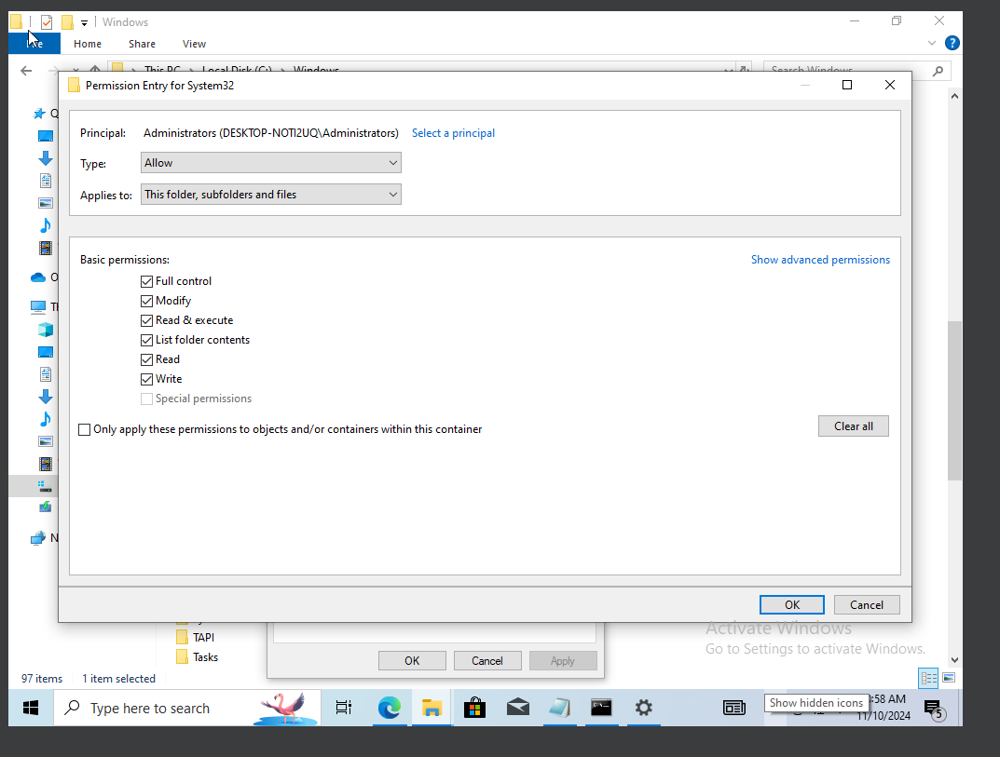
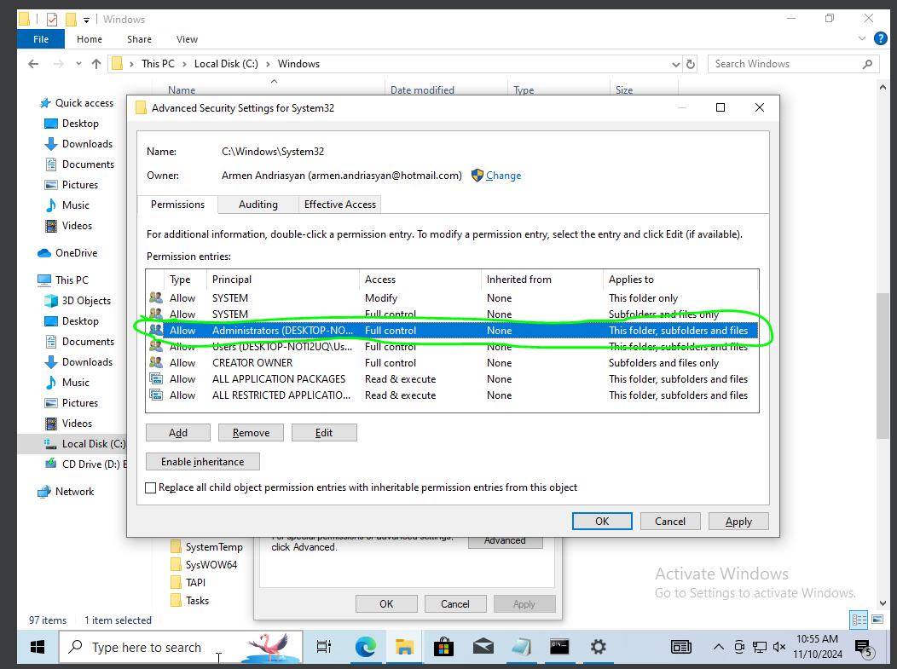
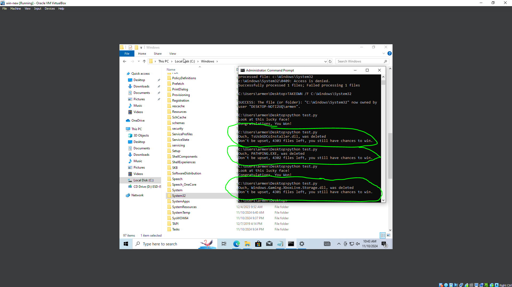
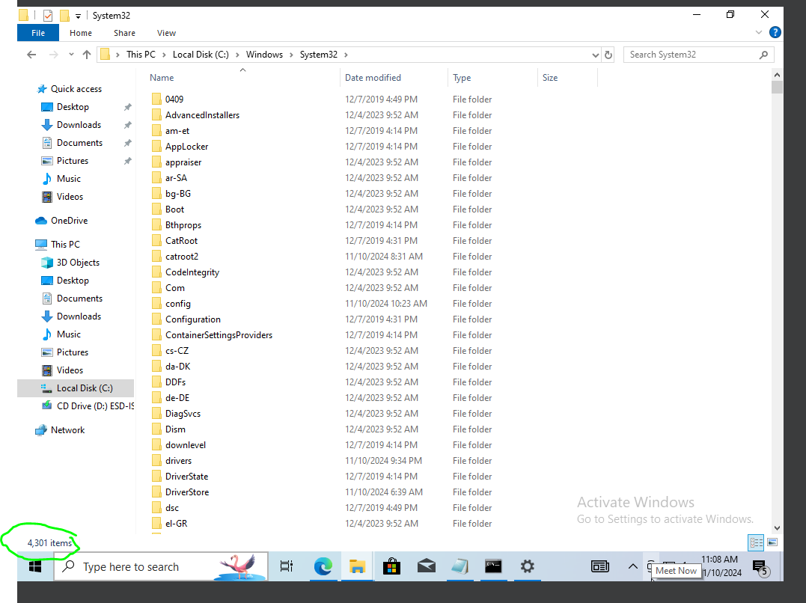

# Russian Roulette: Windows System32 Random File Deletion Game


---
> ## Disclaimer :
>
> This project is intended for _**entertainment purposes**_ only.  
> _**It's a joke!**_ It should never be used on a real Windows system, as it can cause irreversible damage.
---
## Intro
Well, I’ve seen some people trying to have fun with this idea on TikTok but struggling to make it work.

So, I'm rolling out a real script that works.

Worth mentioning, I’m not using C language to avoid enabling misuse by pseudo-hackers. If you’re a "hacker," you already know how to do it, right? Lol.

And yeah, if you work at a call center and try to use this script on elderly American folks, your favorite cow will die today and then haunt you every night. So you’ll be dealing with nightmares.

---
## Rules

- If the random number generator decides to be unkind (and it often is), a random file from the System32 directory will be deleted.
- If you’re lucky, you’ll be greeted with a message that says, “Look at this lucky face! Congratulations, You Won!” You’ll be spared from any file deletion.

---
## How to Play

Welcome to the Windows System32 Random File Deletion Game!

1. First of all, sign into Windows using the administrator account.
2. Then go to `C:\\Windows`, select the `Win32` folder, and open its properties.
3. In permissions, select `TrustedInstaller` and click `Remove`, then `OK`. This may fail, and you may see errors—just close them. Keep trying until `TrustedInstaller` is removed from the list.
4. Next, choose your account, click on it, press edit, and select `Full` access:
   
5. You’re ready once the permissions look like this:
   
--- 
## Show begins

1. Run cmd as administrator.
2. Run the script from the terminal.
```bash
python roullete.py 
```

3. You’ll see the number of files decrease.
   
   

---
## Important note

Even though we’ve obtained control over the folder, Windows will still prevent deletion of core files.

Before running the game in `kill_em_all` mode, I had 4,302 items; afterward, I had 960 files:


This means 3,342 files were successfully deleted from `Win32`.
We could go deeper into the OS and try to delete more files or replace them with blank or corrupted ones.
